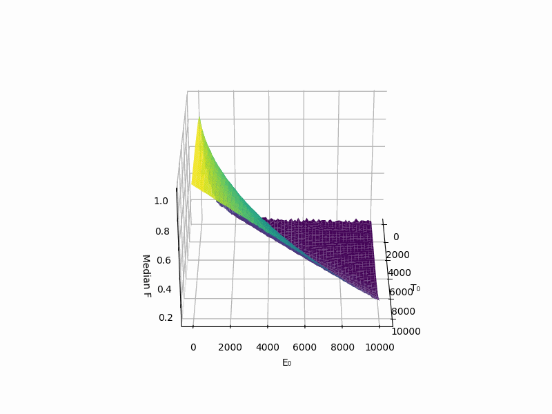
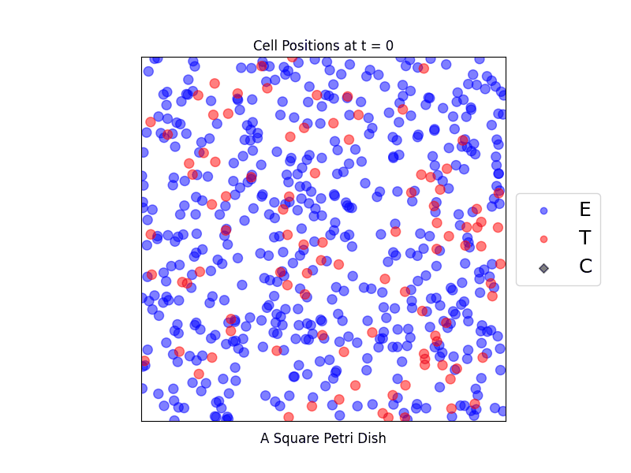

# mti_takeda_project

## Overview

This repository contains a computational exploration of CAR-T cell therapies using both agent-based models (ABMs) and ordinary differential equations (ODEs) to simulate and analyze the interaction between effector (CAR-T) cells and tumor cells.

The project was developed as part of the Math-to-Industry Boot Camp, sponsored by Takeda Oncology to answer key questions about how effector-to-target (E:T) ratios and cell dynamics influence treatment outcomes in cell therapy. We use a combination of synthetic simulations, mechanistic modeling, and statistical analyses to:

- Reproduce lab-observed dynamics using an interpretable ABM
- Generate synthetic datasets to validate ODE approximations
- Compare modeling approaches across different data types (trajectory vs endpoint)
- Investigate parameter identifiability and model transferability

Our goal is to understand how well low-dimensional ODE models can capture the richness of agent-based simulations and whether a single parameter set can describe multiple initial conditions. The insights gained may inform strategies for optimizing CAR-T cell dosing and timing in future therapeutic designs.

Effectiveness (F-score) across different values of initial Effector and Target counts:

ABM simulation of Effector, Target, Complex interactions:

## Repository Structure

This repository contains Jupyter notebooks, Python modules, data, figures, presentation slides, and references related to agent-based and ODE modeling of CAR-T cell and tumor interactions.

### Main Directory

Notebooks and Python Files

- agent_model.ipynb
    Demonstrates how our Agent-Based Model (ABM) works. Includes single-run simulations, Monte Carlo, and grid Monte Carlo experiments.
- agent_model_V2.ipynb
    Explores more complex E/T cell interaction dynamics. This was an unsuccessful attempt and not used for final results.
- fit_ABM_with_trajectory_data.ipynb
    Early attempt to fit synthetic or lab time-series data to the ABM.
- fit_ODE_with_ABM_synthetic_data.ipynb
    Tests whether an ODE model can replicate ABM-generated data using a single parameter set across different E/T initial conditions.
- fit_ODE_with_endpoint_data.ipynb
    Fits the ODE model using only initial and final T cell counts and E:T ratio, without full time series.
- generate_ABM_synthetic_data.ipynb
    Runs ABM simulations under varied initial E/T counts to generate data for ODE model fitting.
- infer_ODE_given_data.ipynb
    Attempts to learn a system of ODEs directly from time-series data. Ultimately not pursued due to lack of biological interpretability.
- master_equation.ipynb
    Explores a 1D master equation to model probabilistic dynamics of tumor cell populations.
- statistical_analysis_blinded_data.ipynb
    Uses Hill model to analyze blinded endpoint trial results.
- ima_takeda.py
    Contains all the code for the ABM simulation and plotting logic.

### MATLAB/ Folder

This folder contains MATLAB scripts for visualizing and analyzing ODE-based tumor-immune interactions. These scripts complement the Python modeling work by offering an alternative environment for surface visualization and analysis.

- tumor.m
    Defines and solves the ODE system describing tumor cell dynamics.
- F_tumor_ode.m
    Computes the final T cell count or any other outcome of interest for a given initial E and T count.
- surfaceplot_ode.m
    Generates a surface plot of final outcome values across a grid of initial E and T values using the F_tumor_ode function. The surface can be compared directly with ABM-generated results from the Python notebook.

### picture/ Folder

Visuals and animations from simulations:

- rotating_surface.gif – F score surface (see agent_model.ipynb)
- snapshot_*.gif – Simulation animations (see agent_model.ipynb)
- tumor_distribution.gif – Time-evolving tumor cell distribution (see master_equation.ipynb)

### data/ Folder

Contains raw, processed, and synthetic data:

- blinded_data.csv – Blinded trial result data (means, SDs, E type, etc.)
- endpoint_data.csv – Processed endpoint counts
- error_endpoint_data.csv – Raw version of endpoint counts (incomplete understanding)
- E-{E0}_T-{T0}_AGG.csv – ABM-generated synthetic data for specific E0, T0
- ODE_synthetic_data.csv – Reversed experiment: ABM fit to ODE data
- grid_F.pkl – Cached grid F-surface result (ABM is slow to rerun)
- ABM synthetic data configuration.txt – Parameter settings for ABM-generated data
- lab_data_from_hour_32.csv, raw_time_series.csv, splined_trajectories_ETratio_low.csv – From or processed from CART_SINDy repo

### slide show/ Folder

Contains presentation slides prepared for team meetings and reporting.

### research paper/ Folder

Includes reference papers relevant to the project and model justification.

## License

This repository is licensed under the MIT License. By contributing to this repository, you agree to license your contributions under the same terms.

## Data Attribution

The files in `data/splined_trajectories_ETratio_low.csv`, `data/raw_time_series.csv`, and `data/lab_data_from_hour_32.csv` are either directly obtained or processed from data published in the [CART_SINDy](https://github.com/alexbbrummer/CART_SINDy) repository by Alex Brummer.

The original data is licensed under the MIT License. A copy of the license is included in `data/LICENSE_CART_SINDy.txt`.
